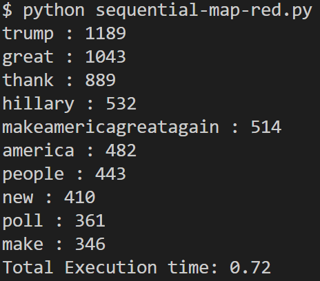
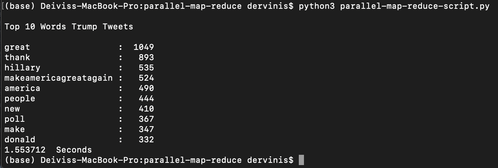

# Dervinis Philips Distributed Mobility Assignment 2

## Team Members
- Deivis Dervinis | 991436536
- Mark Philips | 991365421

## Sequential MapReduce
- Language of choice: Python

## Parallel MapReduce
- Language of choice: Python
- Distributed solution choice: Multiprocessor

## Program Output
### Sequential MapReduce

### Parallel MapReduce

